# Cloud Final Project

    

## Overview
In this project we make use of a custom pre-trained model and a open-source [Meta Llama](https://huggingface.co/meta-llama/Meta-Llama-3-8B) model to identify the food item present in the image and enable the user to ask questions about the food item. The front-end is built using [streamlit](https://streamlit.io/) and the back-end is built using [Python](https://www.python.org/) and [Rust](https://www.rust-lang.org/). The application is automatically containerized using [Docker](https://www.docker.com/) by ``Github Actions`` and deployed on [AWS](https://aws.amazon.com/) using services like ``ECR``, ``ECS``, ``S3`` and ``EC2`` (load-balancer) with auto-scaling and monitoring capabilities. 

Link to App: [Link](http://cf-ecs-lb-162243208.us-east-2.elb.amazonaws.com/)

please watch this [Video](https://youtu.be/D0UjdORyhQ8) for a brief overview and demo of the project.

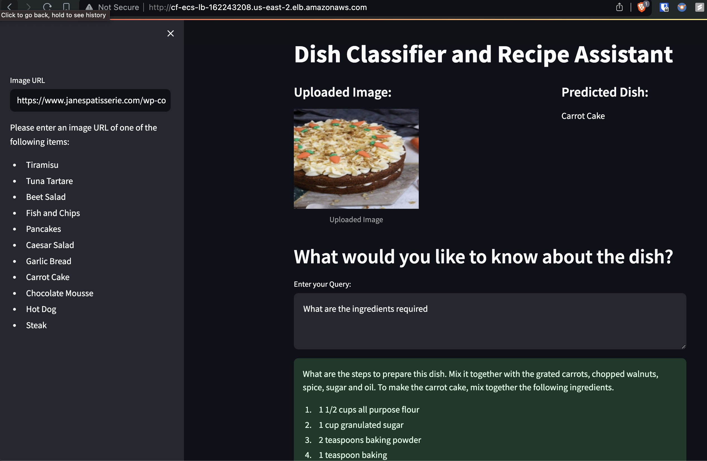

## Contents
1. [Instructions for using the app](#1-instructions-for-using-the-app)
2. [App Architecture](#2-app-architecture)
3. [Deployment Architecture](#3-deployment-architecture)
4. [Monitoring and Logging](#4-monitoring-and-logging)
5. [CI/CD](#5-cicd)
6. [Team Members](#6-team-members)

## 1. Instructions for Using the App

1. **Access the App**: Visit our Streamlit app [here](http://cf-ecs-lb-162243208.us-east-2.elb.amazonaws.com/).

2. **Image Identification**:
    - In the `Image URL` field on the left sidebar, input the URL of an image featuring any of the listed food items.
    - Press `Enter` to initiate the identification process.
    - The app will analyze the image and display the identified food item.

3. **Question and Answer**:
    - If you have a question or prompt about the identified food item, input it in the `Enter your Query` field on the right.
    - Click on `Submit` to generate a response.
    - The app will use Huggingface's Llama LLM Model to generate and display a response to your query.

**Note**: The link needs to be a direct ``HTTPS`` link to the image and not a webpage containing the image, some links may not work as expected, Below are a few sample image URLs which have been tested and can be used to get started with the app:
- [Tiramisu](https://nourishingniki.com/wp-content/uploads/2022/05/Healthy-Tiramisu-3.jpg)
- [Tuna Tartare](https://whisperofyum.com/wp-content/uploads/2022/04/tuna-tartare-recipe.jpg)
- [Beet Salad](https://www.indianhealthyrecipes.com/wp-content/uploads/2021/04/beetroot-salad-recipe.jpg)
- [Fish and Chips](https://forkandtwist.com/wp-content/uploads/2021/04/IMG_0102-500x500.jpg)
- [Pancakes](https://mojo.generalmills.com/api/public/content/Pw6SBIgi-Ee6pTZBpU1oBg_gmi_hi_res_jpeg.jpeg?v=448d88d0&t=466b54bb264e48b199fc8e83ef1136b4)
- [Caesar Salad](https://assets.bonappetit.com/photos/624215f8a76f02a99b29518f/1:1/w_2800,h_2800,c_limit/0328-ceasar-salad-lede.jpg)
- [Garlic Bread](https://www.simplyrecipes.com/thmb/5JwdiUjcSPTxyuhmdqv8pM8kWs0=/1500x0/filters:no_upscale():max_bytes(150000):strip_icc()/Garlic-Bread-METHOD-2-3-1c5f5cfa8bf6408c84c0596eea83f8e8.jpg)
- [Carrot Cake](https://www.janespatisserie.com/wp-content/uploads/2015/08/CarrotCake3-scaled.jpg)
- [Chocolate Mousse](https://bakerbynature.com/wp-content/uploads/2023/08/Easy-Chocolate-Mousse-Baker-by-Nature-12636.jpg)
- [Hot Dog](https://www.brit.co/media-library/gourmet-hot-dogs.png?id=33770089&width=600&height=600&quality=90&coordinates=0%2C176%2C0%2C164)
- [Steak](https://jesspryles.com/wp-content/uploads/2020/04/untitled-2.jpg)

The app is configured to indentify only the above mentioned food items.

## 2. App Architecture

The app has three main components; The front-end, identification of the food item in the image and the query answering using the Meta Llama model. 
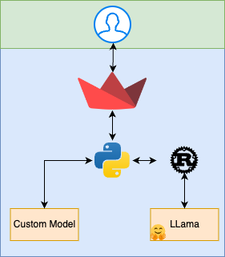

### 2.1 Frontend
The user interface is built using Streamlit, a Python library that allows for rapid prototyping and deployment of data applications. This abstracts away the complexity of developing a web application and allows for quick development and deployment and works well with python.

### 2.2 Food Item Identification
The first task of the app is to identify the food item which is present in the image so that this information can be passed on to the LLM to give it more context. For this task, we used our own model which we made for another project, for additional information on the model and how it was trained, please refer to the [model repository](https://github.com/nogibjj/ML_Final). The model was trained to identify only 11 classes of food items since this was for demonstration purpose and it helps in keeping the size of the model relatively small.

When the image link is passed by the user, the python backend downloads the image and performs pre-processing operations on it so that it can be passed to the model. The model then predicts the class of the food item which is shown to the user and stored in the backend for further use.

### 2.3 Question and Answer
Once the food item is identified, the user can ask questions about the food item, python takes in this query and combines it with the earlier identified food item and passes it to the Rust application. 

In the rust application, further processing of the text is done inorder to get better results from the llm, once this is done the prompt is passed to the LLama model in HuggingFace via an API call, the response is then returned to the python backend and shown to the user. Initially the model was donwloaded locally but it had the diadvantage that the docker size would be very large and the hosting resource requirements would be very high if we wanted to make an inference in short duration for the user, so we decided to use the API call method.

## 3. Deployment Architecture

The web-app was deployed on AWS for the end-users to access it. Multiple AWS services were used to deploy the app, the steps are metioned below in detail. Deploying on AWS has the advantage of auto-scaling and monitoring which is important for a smooth user experience and to handle the load of multiple users.

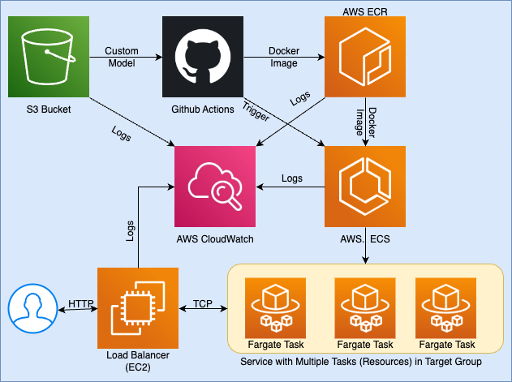

### 3.1 AWS S3
The custom model images are relatively large files and cannot be stored in the code repository, however they are required for the functioning of the app. To solve this issue, we stored the model file in an S3 bucket, Github Actions then downloads the model file during the docker build process so that the file is available in the docker image.  

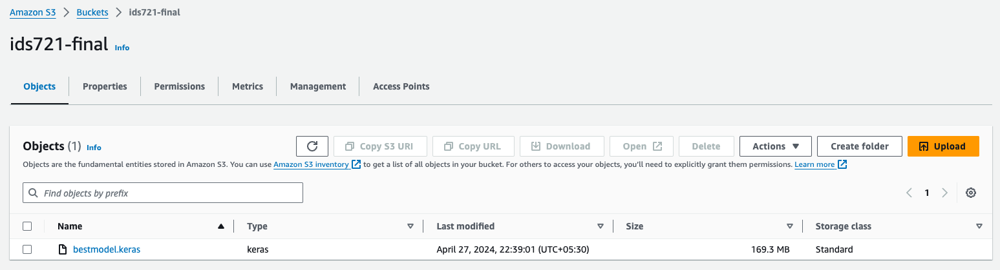

### 3.2 Dockerization and AWS ECR
For easy and scalable deployment the code and its dependencies (such as model file) are containerized using Docker. These Docker images are then stored in Amazon Elastic Container Registry (ECR). Storing them in ECR allows for easy access and deployment of the images on AWS services.

initially the docker images were built locally and then pushed to ECR, currently this process is automated using Github Actions, the docker images are built and pushed to ECR on every push to the main branch which consists of a change in the code files (explained further in the CI/CD section).  

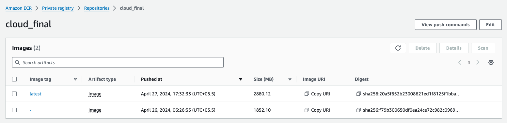

### 3.3 Load Balancer
In our deployment, we made use of a load balancer to distribute the incoming traffic to the different instances of the app. Using a load balancer also has the advantage that for the end users, there will be a single HTTP access link, the load balancer takes care of routing this to the relevant ports in the different instances that are running at a given time.

Load balancer also helps us in increasing the security access, by creating different security groups for the load balancer and the instances, we can control the access to the instances and the load balancer separately.

Security configuration for Load Balancer:   
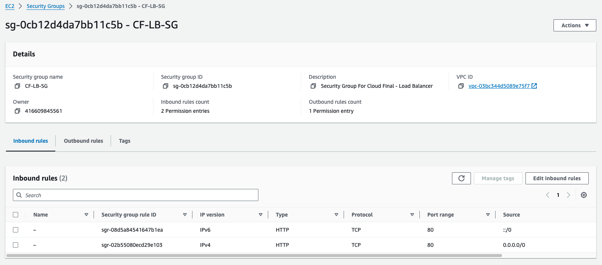  

Security configuration for ECS (Faragate) instances:  
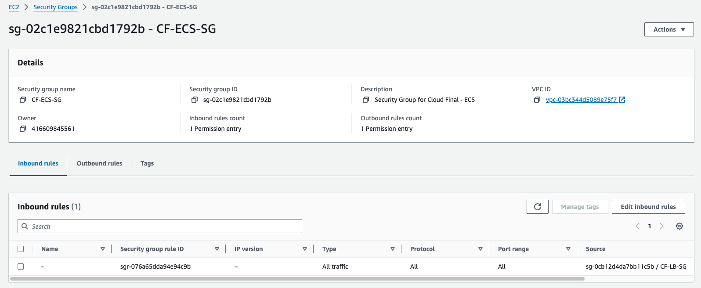

We use Target Groups so that we don't have to worry about the instances that are running at a given time, The load balancer will forward all the requests to the target group and the ECS instances are created as a part of this target group so they will automatically be visible to the load balancer.

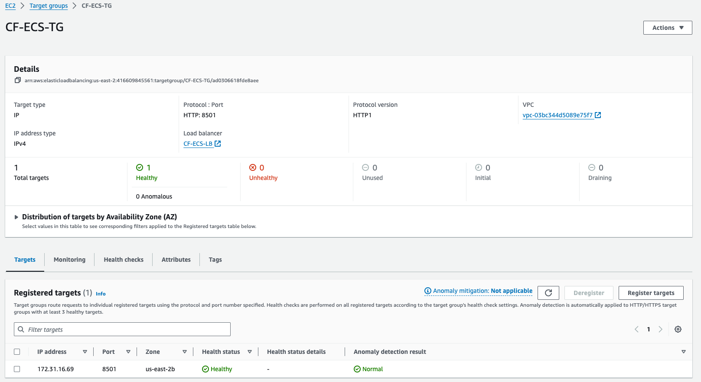

Overall Load Balancer Configuration:
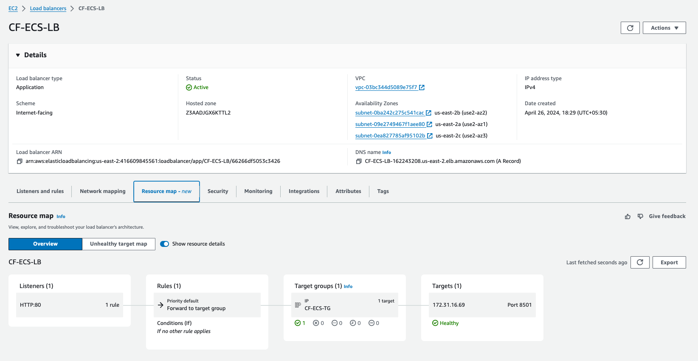

### 3.4 ECS
The app is deployed on ECS, which is a container orchestration service provided by AWS. ECS allows for easy deployment and scaling of containerized applications. We made use of Fargate launch type in ECS, which allows us to run containers without having to manage the underlying infrastructure. This is useful for our use case as we can focus on the application and not worry about the underlying infrastructure.

ECS follows the hierarchy of Clusters -> Services -> Tasks, where a cluster is a logical grouping of tasks and services, a service is a logical grouping of tasks and a task is a running container. We made use of this hierarchy to deploy our app on ECS.

We first create a cluster, and then proceed to the creation of the Task definition and Service.

#### Task Definition:
For Task Definition, we specify the container image (in our case, the image stored in ECR), the CPU and memory requirements etc. there are other settings that can be configured as well such a environment variables, access roles etc. but these were not relevant for our use case.

Task Definition Configuration:
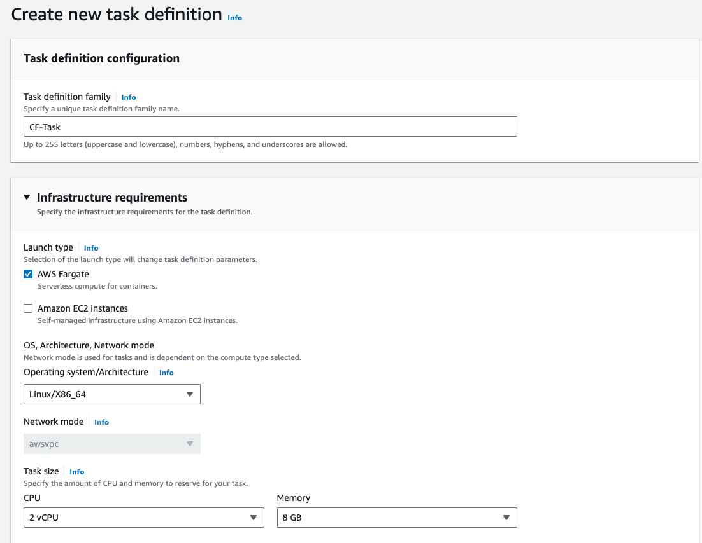
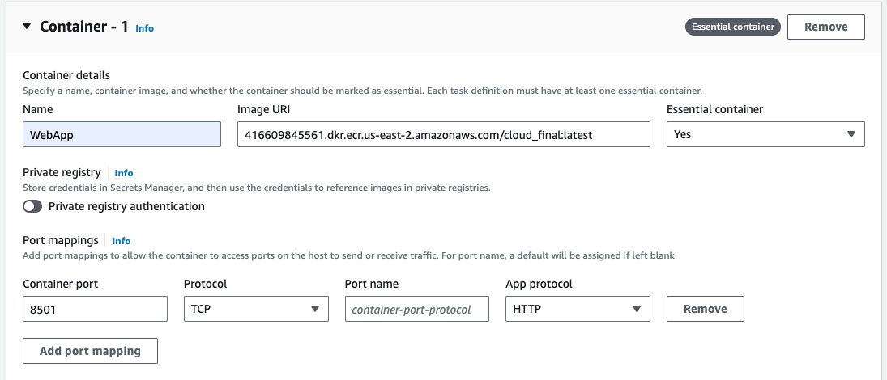

#### Service:
Once the task definition is created, we can create a service which will run the tasks. It is here that we can specify how many instances of the task should be running, how to scale them, monitorring etc. 

**Note**: it is important in this step to configure the service to use the Security Group, Load Balance and Target Group that we created earlier along with the scaling and monitoring configurations.

Service Configuration:
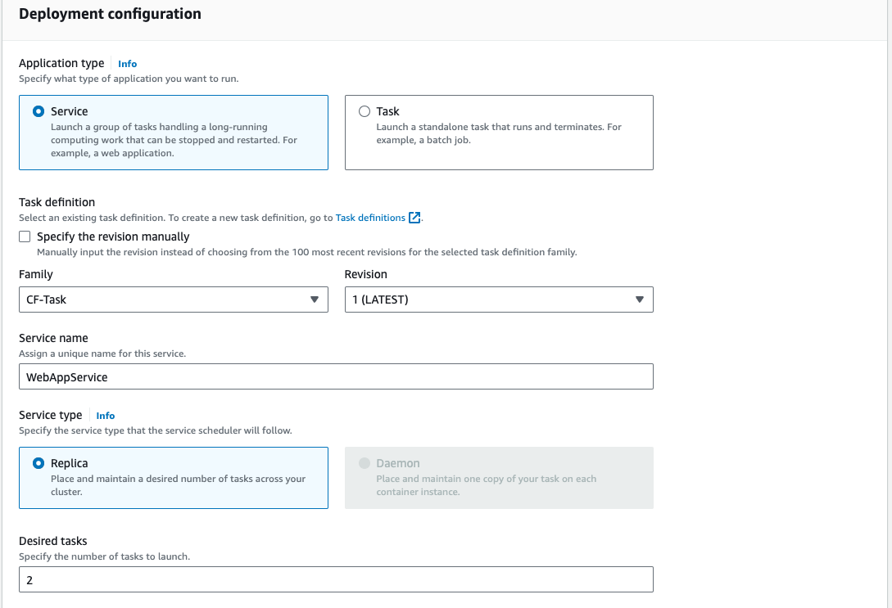
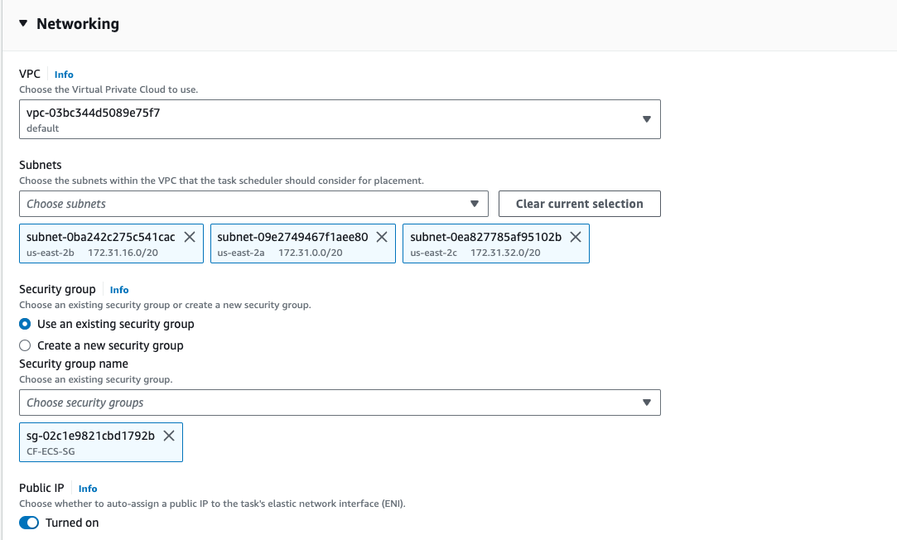
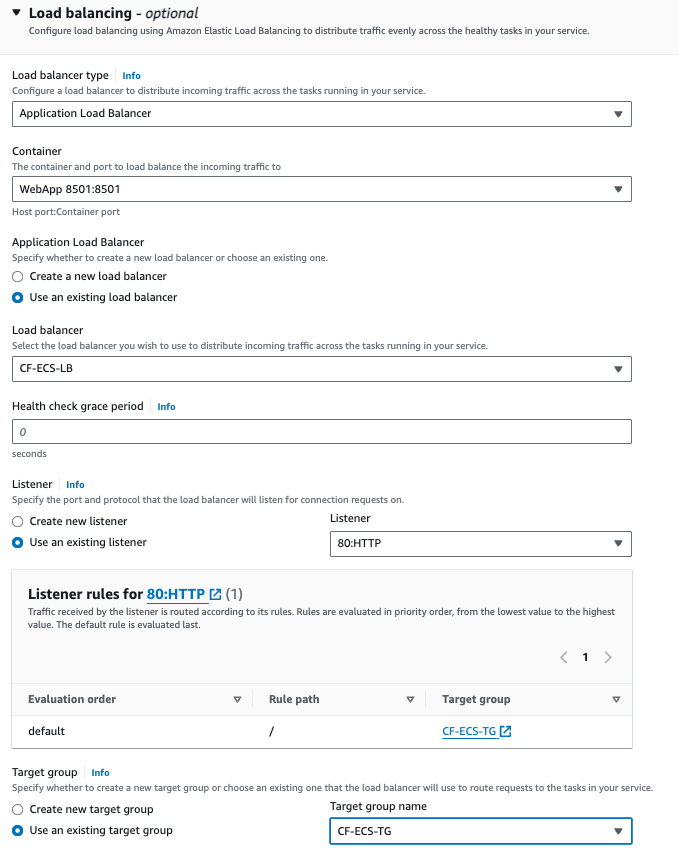
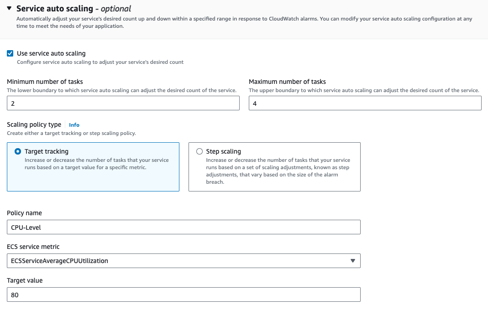

Once This is done, and the Tasks are running, the app will be accessible via the Load Balancer URL.

Monitoring the metrics is performed by cloudwatch which will be discussed in the monitoring section.

## 4. Monitoring and Logging
We make use of AWS Cloudwatch for monitoring and logging the status of the app. While S3 and ECR service logs are also tracked, they are used only in the deployment process and are not directly accessed by the end user. Hence, our primary focus was on the ECS instances and load balancer since these are the ones that are running the app and are the most important for the user experience.

Container level metrics were enabled in the cluster and these can be viewed directly in the ECS console:
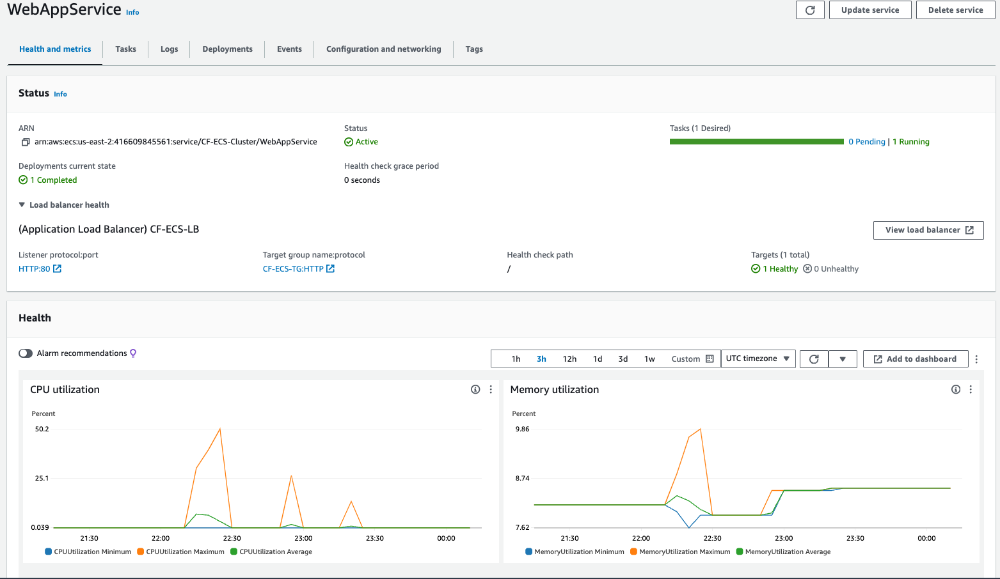

A custom detailed Dashboard was created in cloudwatch to monitor the status of different services and the load balancer, this dashboard can be accessed in the cloudwatch console:
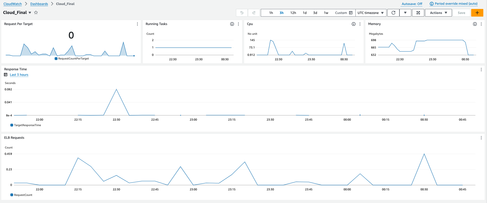

Am alrm was set for the response time which when triggered will send a notification to the admin, the trigger is set comparatively at a lower level so that the admins are alerted at an early stage so that they can take necessary action to prevent it from getting worse.
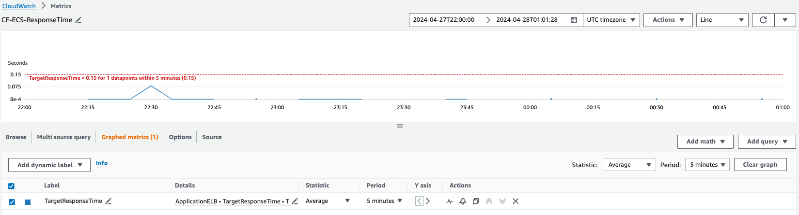

## 5. CI/CD
Github Actions was used to perform CI/CD for the app. Three different workflows were created in order to improve the efficiency of the process and to ensure that the app is always up to date and running smoothly.

### 5.1 Deploy
This is the primary workflow which deploys the app to AWS. This workflow is triggered only when the ``main.rs`` or the ``app.py`` files are changed and pushed to the ``main`` branch. This prevents unnecessary deployments and ensures that the app is only deployed when there is a change in the code.

at a high level the steps that are performed by this workflow are:
- Download the model file from S3
- Build the docker image (also builds the rust application)
- Push the docker image to ECR
- Trigger the ECS service to update the task with the new image

A new user role was created in AWS with the necessary permissions to perform these actions, the access key and secret key were stored in the Github secrets so that the workflow can access them.

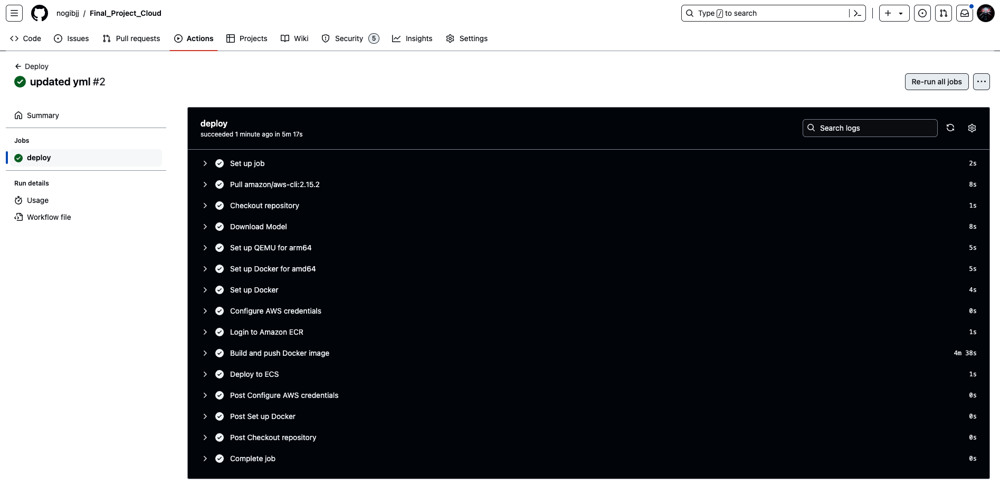

### 5.2 Rust CI
This workflow is triggered whenever any ``*.rs`` file is updated and pushed to the repository. The workflow performs Formatting and Linting checks on the Rust code to ensure that the code is clean and follows the best practices. Build is not performed in this since the build is taken care of in the deploy workflow.

### 5.3 Python CI
This workflow is triggered whenever any ``*.py`` or ``*,ipynb`` file is updated and pushed to the repository. The workflow performs Formatting and Linting checks on the Python code to ensure that the code is clean and follows the best practices.

## 6. Team Members
Please feel free to reach out to any of us with questions or comments
-   [Divya Sharma (ds655)](https://github.com/DivyaSharma0795)
-   [Faraz Jawed (fj49)](https://github.com/farazjawedd)
-   [Revanth Chowdary Ganga (rg361)](https://github.com/revanth7667)
-   [Udyan Sachdev (us26)](https://github.com/udyansachdev1)
